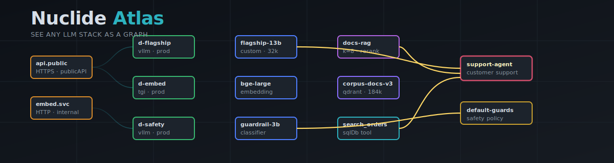
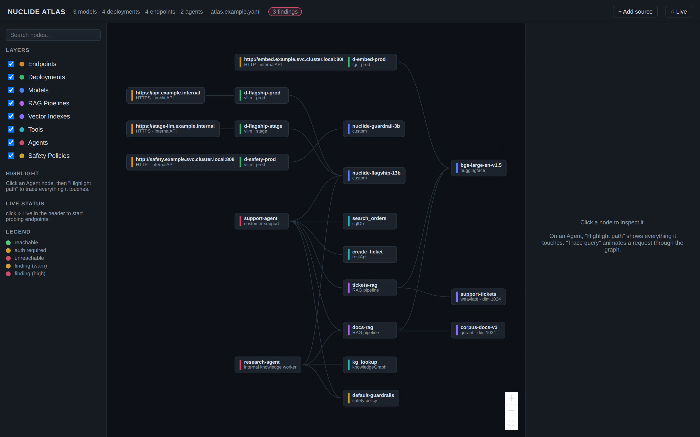
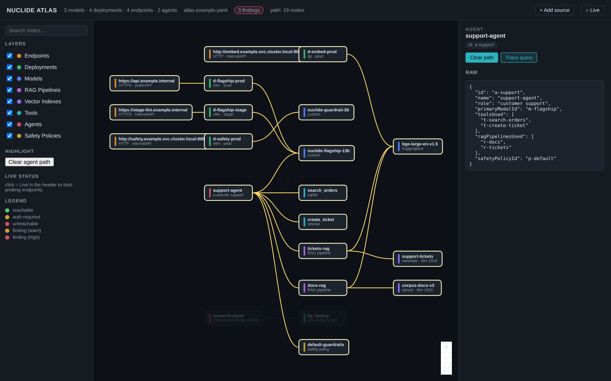

[](https://claude.ai/code)

<p align="center">
  
</p>

# Nuclide Atlas

[](https://opensource.org/licenses/MIT)
[](https://github.com/Nicholas-Kloster/nuclide-atlas/releases)
[](https://github.com/Nicholas-Kloster/nuclide-atlas/actions/workflows/release.yml)
[](https://github.com/Nicholas-Kloster/nuclide-atlas/pkgs/container/nuclide-atlas-backend)
[](https://github.com/Nicholas-Kloster/nuclide-atlas/stargazers)

**See any LLM stack as a graph.** Atlas finds the LLM services you are
already running, draws them as a map, and lets you click anything to
see what it is, what it touches, and what it is exposing. Point it at
localhost, a URL, a Kubernetes namespace, or a YAML inventory. It
renders the same way.

## Why Atlas exists

Every team running modern AI has a stack they cannot fully describe.
The reasons are familiar:

- A data scientist stands up Ollama on a dev VM "just to test," and it
  ends up on the corporate VPN with three models loaded.
- A platform team deploys vLLM behind an internal load balancer, and
  the only documentation is a Helm chart and a screenshot in Slack.
- An agent framework wires four tools and two RAG pipelines together,
  and no one outside the team can explain which one of them touches
  customer data.
- Compliance asks "what does the support agent reach?" and the answer
  is twenty minutes of reading agent YAML, Helm values, and Python
  config classes.

Inventory tools assume you already know the inventory. Agent
frameworks document themselves at the framework level, not the
deployment level. Generic dashboards (Grafana, Datadog) show metrics
but not topology. Nothing renders the wiring.

Atlas does. Point it at the running stack, get a graph. Click any
node, see what it is. Click an Agent, see the blast radius. The map
becomes the documentation.

<p align="center">
  
</p>

## Try it in 30 seconds, no infrastructure required

```bash
git clone https://github.com/Nicholas-Kloster/nuclide-atlas.git
cd nuclide-atlas
bin/atlas-demo            # spawns mock Ollama / vLLM / Qdrant on loopback
                          # then runs bin/atlas-bootstrap
# browser opens http://localhost:3000
```

## Use it on your real stack

```bash
bin/atlas-bootstrap       # auto-discovers everything Atlas can see
```

### Or pull the published images

```bash
docker pull ghcr.io/nicholas-kloster/nuclide-atlas-backend:latest
docker pull ghcr.io/nicholas-kloster/nuclide-atlas-frontend:latest
```

Multi-arch (amd64, arm64). See [Releases](https://github.com/Nicholas-Kloster/nuclide-atlas/releases) for tagged versions.

That command:

1. Scans `OPENAI_API_BASE`, `OLLAMA_HOST`, `MLFLOW_TRACKING_URI`, and
   peers for any base URLs already set.
2. Sweeps a catalog of known LLM ports on localhost (`11434` Ollama,
   `8000` vLLM, `8081` TGI, `6333` Qdrant, `8089` Weaviate,
   `5000` MLflow, `3100` Langfuse, `6006` Phoenix, `7860` Gradio, …).
3. Reads `docker ps` for containers running known LLM images.
4. Optionally reads a Kubernetes namespace via `kubectl`.
5. Writes the result to `config/atlas.yaml`.
6. Boots the stack via `docker compose` and opens the browser.

Exit codes are stable so CI / Claude Code can branch on them:
`0` ok · `64` no services found · `65` no docker · `66` port busy.

If `aimap` is on `PATH`, Atlas hands URL probes to it for richer
fingerprinting; otherwise the built-in stdlib probes carry the load.

## What it solves for developers

**Onboarding.** A new hire pulls the repo, runs `bin/atlas-bootstrap`,
and sees the whole stack in one screen. No "ask three people which
model the support agent actually uses."

**Local dev.** Atlas auto-discovers Ollama, vLLM, and the vector DB
running on your laptop, draws the map, and lets you click "Trace
query" to watch a request flow through it. The graph becomes your
debugger when something silently breaks.

**Blast-radius checks before merging.** Click an Agent, hit "Highlight
path," and everything outside the agent's reach dims. The next time a
PR adds a new tool to an agent, you can see exactly what access it
gains before approving. Same view answers compliance reviews without
spelunking through agent framework code.

**Schema drift caught at startup.** Discovery output validates through
the same Pydantic models the backend serves. If real infrastructure
stops matching the YAML inventory, startup fails loud. The map cannot
quietly lie.

**Programmatic stack checks.** `GET /api/graph` returns the inventory
as JSON. `GET /api/risk` returns deterministic rule-based findings. CI
can grep both. Pre-deploy gate: "is any `publicAPI` endpoint serving
with `authType: none`?" returns a list and exits non-zero.

**Live ops.** Toggle Live Pulse and Atlas re-probes every 15 seconds,
coloring endpoints green / amber / red. When on-call says "the embed
service is flaky," the map tells you which deployment, which model,
and how many agents depend on it.

**Zero-infrastructure evaluation.** `bin/atlas-demo` spins up mock
Ollama, vLLM, and Qdrant on loopback in one command. Useful for
teaching agent architecture, evaluating Atlas, or proving a UI change
works without touching prod.

The throughline: every concept in an LLM stack (model, deployment,
endpoint, RAG pipeline, vector index, tool, agent, safety policy) has
one canonical place to look. Read once, link forever.

## What you can actually do once it is open

- **See the stack as one picture.** Endpoints → Deployments → Models →
  RAG pipelines / Vector indexes / Tools → Agents. Edges are the wiring.
- **Drill into anything.** Click a node, see its full config in the
  right panel plus a metrics snapshot for serving entities.
- **Trace what an agent touches.** Click an Agent → "Highlight path"
  dims everything outside its blast radius. Useful for compliance
  reviews ("if this agent leaks, what data was within reach?").

<p align="center">
  
</p>

- **Watch a query flow.** Click an Agent → "Trace query" animates a
  request from agent through safety → RAG → tools → model → endpoints
  → back through safety.
- **Live pulse.** Toggle ● Live in the header and Atlas re-probes every
  15 seconds, coloring endpoints green / amber / red.
- **Risk badges.** Atlas runs deterministic rules and dots nodes that
  fail them (internal API with no auth, RAG with high-k and no
  reranker, safety policy with zero filters, …). Hover for the rule id.
- **Search.** Type into the sidebar search box; everything that doesn't
  match fades.
- **Filter layers.** Toggle Tools, Vector, Safety on/off when you only
  care about the serving path.
- **Add a source on the fly.** `+ Add source` in the header opens a
  modal that probes a URL, re-runs discovery, or accepts a list of
  extra hosts.

## What Atlas is, and is not

Atlas is **internal observability** for an LLM stack. It only contacts
hosts you put in the config or hand to a probe. It does not scan, it
does not move laterally, and it does not call home.

For external discovery of LLM infrastructure you do not own, use
[aimap](https://github.com/Nicholas-Kloster/aimap). Atlas reads its
JSON output if you want to pipe one into the other.

## Architecture

| Service          | Port | Stack                                  |
| ---------------- | ---- | -------------------------------------- |
| `atlas-backend`  | 8000 | FastAPI · Pydantic v2 · stdlib probes  |
| `atlas-frontend` | 3000 | Vite · React · @xyflow/react · dagre   |

The backend is the source of truth for the schema
(`backend/app/models.py`). The frontend mirrors it in
`frontend/src/lib/types.ts`. Discovery output validates through the
same schema before being written to disk. Drift fails loud at startup
rather than silently.

## API

```
GET  /api/healthz                       liveness
GET  /api/graph                         full inventory
GET  /api/probe                         run probes against declared endpoints
GET  /api/metrics/{entityType}/{id}     stubbed metrics
GET  /api/risk                          rule-based findings, per entity
GET  /api/sources                       where the current config came from
POST /api/discover                      re-run discovery, rewrite atlas.yaml
POST /api/import-url    {"url": ...}    probe a URL, merge into atlas.yaml
```

`entityType` is one of `model deployment endpoint ragPipeline vectorIndex tool agent safetyPolicy`.

## Configuration

Two files in `config/`:

| File                      | Role                                                        |
| ------------------------- | ----------------------------------------------------------- |
| `atlas.example.yaml`      | Committed sample. Renders on a fresh clone before discovery. |
| `atlas.yaml`              | Auto-generated by bootstrap. Gitignored.                    |

The backend prefers `atlas.yaml` and falls back to `atlas.example.yaml`,
so you always have something to render.

Probe credentials are env vars, never the YAML:

```
ATLAS_PROBE_TOKEN_E-MY-ENDPOINT=...   # bearer / api_key for endpoint id
```

A 401 from a credentialed probe is a useful result. It means the
endpoint is up and auth is enforced.

## Kubernetes

```bash
kubectl apply -k deploy/k8s
kubectl -n nuclide-atlas port-forward svc/atlas-frontend 3000:3000
```

The manifests under `deploy/k8s/` are a skeleton: `Deployment` +
`Service` for backend and frontend, plus a `ConfigMap` for the
inventory. Add an Ingress, NetworkPolicy, and real resource limits
before exposing outside the cluster.

## Local development

```bash
# backend
cd backend
python -m venv .venv && source .venv/bin/activate
pip install -r requirements.txt
ATLAS_CONFIG=../config/atlas.example.yaml \
    uvicorn app.main:app --reload --port 8000

# frontend (separate shell)
cd frontend
npm install
npm run dev
```

Vite proxies `/api/*` to `http://localhost:8000`, so the UI behaves
identically in dev and inside `docker compose`.

## Extending

| Want to                        | Touch                                                                 |
| ------------------------------ | --------------------------------------------------------------------- |
| Add an entity type             | `backend/app/models.py` → `frontend/src/lib/types.ts` → `graphBuild.ts` |
| Add a discovery probe          | `backend/app/discovery/probes/` + register in `runner.py`             |
| Plug in real metrics           | Replace `backend/app/metrics.py` (`MetricsSnapshot` is the contract)  |
| Add a risk rule                | `backend/app/risk.py`, one if-statement per rule                      |
| Recognize a new framework      | `backend/app/discovery/probes/fingerprint.py` (`_PROVIDER_HINTS`)     |

## License

MIT.
